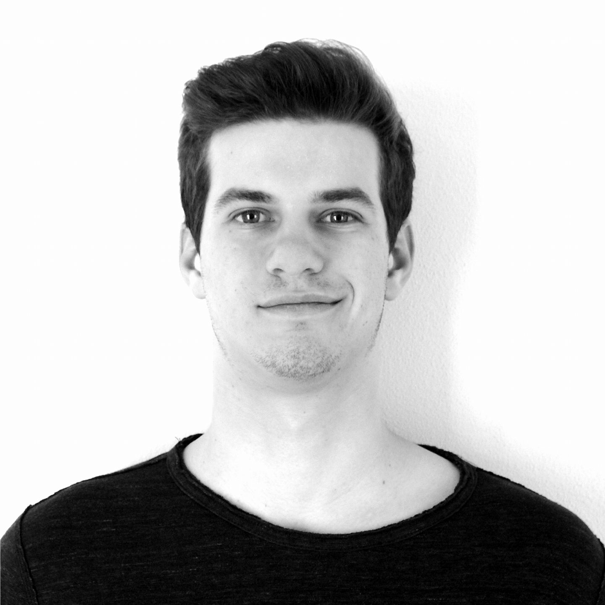

## About Me

I am Gianluca Tasinato, a PhD student in [Uli Wagner](https://ist.ac.at/en/research/wagner-group/) research group at the Institute of Science of Technology Austria ([ISTA](https://www.ista.ac.at)).

My main math interests are in the field of so-called "Topological Combinatorics"; in particular, the main problems I am working on are:

1. Hardness of Promise Constraint Satisfation Problems (PCSPs)
2. Quantitiative Borsuk-Ulam type results (with a focus towards Sierksma's problem)
3. Measure splitting thoerms / Intersection counting problems

Beside mathematics, I enjoy cooking and more generally experiment in the kitchen. If I feel like it I might write down some notes on recepies/techniques I have played with (e.g. spherification and whatnot).

I used to play Bridge semi-decently and I still enjoy my odd game against BBO's bots. Agian, if I can gather the energy, I'll write down a convention card for my old system (I wnat to have the Gazilli convention written down somewhere). I really want to try and make an interactive declaration page but it is an excessive amount of work tbh.

## This Page
This is my homepage, where I'll collect my experiments in web dev and programming more generally.

Additionally, it will slowly become a sort of portfolio/cv of mine, for the world to see! :D

Hopefully there will be some math as well; however the place is going to be a bit empty for the foreseeable future.
